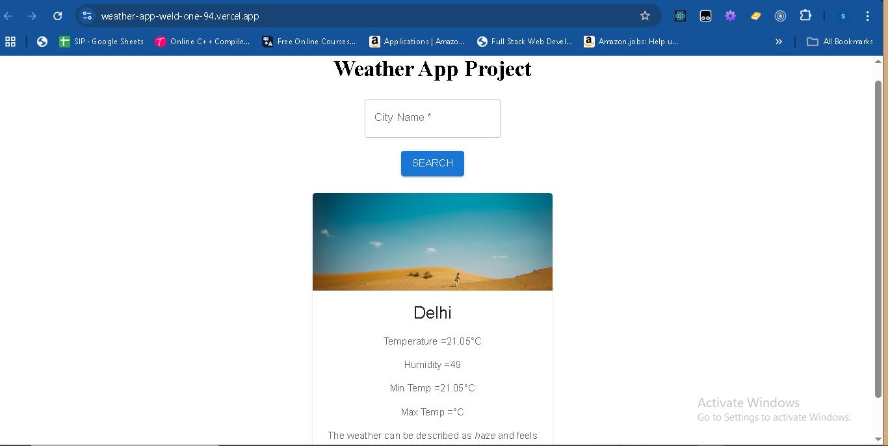

#  WeatherApp

A simple and clean **React Weather App** that shows real-time weather updates using the **OpenWeatherMap API**.

##  Live Demo

 [Click to use the live app](https://weather-app-weld-one-94.vercel.app/)

---

##  Preview



---

##  Features

-  Search by city name
-  Real-time temperature, humidity, pressure, and wind
-  Weather condition with icons
-  Responsive mobile-friendly design
-  Built using **React** and **Axios**

---

##  Tech Stack

- React
- Axios
- OpenWeatherMap API
- Modern CSS

---

##  Installation (For Local Use)

```bash
git clone https://github.com/sudeepkumar21/WeatherApp.git
cd WeatherApp
npm install
npm start
